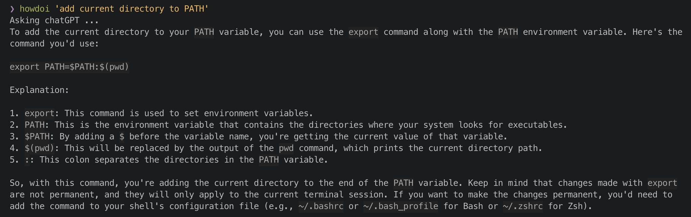

# howdoi

A CLI tool to answer the (many times repeated) question "How do I ... ?" powered by OpenAI's GPT4

## Usage

Open your terminal and write `howdoi "<task-to-perform>"`

## Config

Requires `OPENAI_API_KEY` set to your  [OpenAI API key](https://platform.openai.com/account/api-keys)
